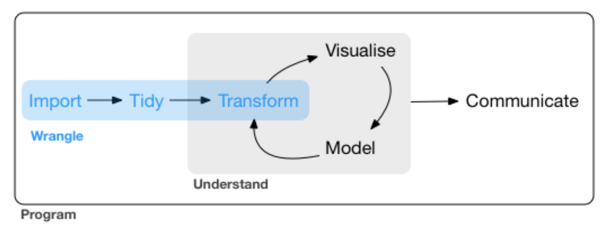

```{r echo = FALSE}
knitr::opts_chunk$set(warnings = FALSE, message = FALSE, echo = FALSE)
```

```{r echo=FALSE}
# packages that will be used in the rest of the presentation
library(dplyr)
library(lubridate)
library(tidyr)
library(readr)
library(stringr)
```

## Introduction 
In this workshop, you’ll learn about data wrangling, the art of getting your data
in a useful form for **visualisation** and **modeling**. There are three main parts to it:

<div style="float: center;">
<br />

</div>


## Data  
Our dataset contains ~ 5 years (2012 - 2017) of hourly measurements of various weather
attributes such as **temperature**, **humidity**, and **air pressure** for 30 US and
Canadian cities, plus 6 Israeli cities. This data comes from **kaggle** and more details can be found [here.](https://www.kaggle.com/selfishgene/historical-hourly-weather-data)


## Importing Data
We are going to use `read_csv(...)` from `readr` package to upload **temperature** 
and **humidity** data.

```{r echo=TRUE }
humidity <- read_csv('../data/humidity.csv',
                     col_types = cols(
                       datetime = col_datetime(
                         format = "%Y-%m-%d %H:%M:%S")))
temperature <- read_csv('../data/temperature.csv',
                     col_types = cols(
                       datetime = col_datetime(
                         format = "%Y-%m-%d %H:%M:%S")))
```

## Let's look at temperature
```{r echo=TRUE }
temperature %>% 
  head(2) 
```

## Tibbles vs. data.frame
Tibbles are **opinionated data frames**. The class of tibble includes “data.frame” which means tibbles inherit the regular data frame behaviour by default.


## Tidyverse 
The tidyverse is a collection of R packages designed for data science. All packages share an underlying design philosophy, grammar, and data structures. It includes all of these:

- dplyr
- ggplot2
- tibble
- purrr
- tidyr
- readr 

## Tidy data 
Using a tidy dataset will be make it easier to work with inside the tidyverse.

A dataset is tidy if:

1. Each **variable** must have its **own column**.
2. Each **observation** must have its **own row**.
3. Each **value** must have its **own cell**.


## Why ensure that your data is tidy?

1. Provides a **consistent way of storing data**. If you have a consistent data structure, it’s easier to learn the tools that work with it because they have an underlying uniformity.

2. Placing variables in columns allows **R’s vectorised nature** to shine. Most built-in R functions, e.g. mutate(), work with vectors of values. That makes transforming tidy data feel particularly natural.


## Reshaping data 
A common problem is a dataset where some of the column names are not names of variables, but values of a variable. The column names **Vancouver**, **Portland**, and **San Francisco**  represent values of the **City** variable, and each row represents multiple observations, not one. 

## Gathering (Wide to Long)
We need to gather those columns and reshape our data into a long format. 

```{r echo=TRUE}
humidity_long <- humidity %>%
  gather(key = 'City', value = 'Humidity', -datetime)

temperature_long <- temperature %>%
  gather(key='City', 'Temperature', -datetime) %>%
  mutate(Temperature = Temperature * 9 / 5 - 459.67)
```


## Two approaches {.build}
What is the mean temperature in Vancouver? 
 
### Base R 
```{r echo=TRUE}
temperatures <- unlist(
  temperature_long[temperature_long$City == 'Vancouver', 'Temperature'])
mean(temperatures, na.rm = TRUE)
```
### dplyr
```{r echo=TRUE}
temperature_long %>% 
  filter(City == 'Vancouver') %>% 
  summarize(mean_temperature = mean(Temperature, na.rm = TRUE))
```


## Base R Subsetting {.build}

- Square brackets are used to subset dataframes.
- `[rows, columns]`
- Many commands operate on a *vector* (column) of data extracted from a dataframe
using the `$`.


## dplyr Subsetting {.build}

- `dplyr` contains separate functions to *filter* rows and *select* columns.
- The dataframe is one argument and the column names are another (no `$`).
- Can also *chain* commands using the pipe *%>% *.
- Any numerical summary that you want to apply to a column of a dataframe
is specified within `summarize()`.

## Why dplyr? {.build}
Real data sets are "big", containing many observations and features to choose from. High in *volume* and *dimension*. Hence, we need a tool that allows us to break the data into manageable and meaningful chunks.  

This is all possible in base R, but with `dplyr`, it is **simple**, **readible**, and **fast**.

## The dplyr Commands {.build}
- select 
- distinct
- filter
- arrange
- mutate
- sample_n
- group_by
- summarize 

## Helper Functions 
Helper        | Desciption 
--------------|-------------
starts_with() | Starts with a prefix
ends_with()   | Select columns that end with a character string
contains()    | Select columns that contain a character string
matches()     | Select columns that match a regular expression
num_range()   | Numerical range like x01, x02
one_of()      | Variables in character vector
everything()  | All variables 


## select() & distinct() {.build}
Often you work with large datasets with many columns where only a few are 
actually of interest. `select()` allows you to rapidly zoom in on a useful
subset. `distinct()` gives you the unique elements for an individual column 

```{r eval=TRUE, echo=TRUE}
select(temperature_long, City) %>% distinct(.)
```

You can exclude columns using `-` and specify a range using `:`. You can also rename
a column. 

```{r eval = TRUE, echo=TRUE}
select(temperature_long, -(City:Temperature), date_stamp = datetime) %>% 
  slice(1:3)
```

## filter() {.build}
### smaller header 

Allows you to select a subset of **rows** that fulfill a set of conditions. 

```{r message = FALSE, warning = FALSE, eval=TRUE, echo=TRUE}
temperature_long %>% 
  filter(City %in% c('Los Angeles', 'San Francisco', 'Las Vegas') & !is.na(Temperature) & Temperature > 85) %>% 
  head(3)
```

## Constructing filters {.build}

Filters are constructed of **logical operators**: `<`, `>`, `<=`, `>=`, `==`,
`!=` (and some others).

Adding them one by one to `filter()` is akin to saying "this AND that", use `&`. To say
"this OR that OR both", use `|`.

## Exercise 1 {.build}
Find the average temperature for cities whose name starts with the letter 'S' for the date = 2012-09-01

## Answer {.build}


## arrange() {.build}
`arrange()` reorders rows. If you provide more than one column name to order by,
each additional column will be used to break ties in the values of preceding columns:
```{r, eval = TRUE, echo=TRUE}
temperature_long %>% arrange(City, datetime) %>% 
  slice(1:5)
```
Use `desc()` to sort in descending order.
```{r, eval = TRUE, echo=TRUE}
temperature_long %>% arrange(City, desc(datetime)) %>% 
  slice(1:5)
```

## mutate() {.build}
As well as selecting from the set of existing columns, it's often useful to add 
new columns that are functions of existing columns. This is the job of `mutate()`:
```{r}
temperature_long %>% 
mutate(date_ymd= date(datetime)) %>% 
  head(2)
```


## summarize() and sample_n() {.build}
`summarize()` collapses a data frame to a single row. It's not very useful yet. 
`sample_n()` provides you with a random sample of the rows.

```{r}
humidity_long %>% 
summarize(mean_humidity = mean(Humidity, na.rm = TRUE))

humidity_long %>% 
  sample_n(10)
```

## Aggregation aka group_by() {.build}
The `group_by()` function repeats the operation individually on groups of observations 
within the dataset. 

## Exercise 2 {.build}
Find the average temperature for all cities 

## Answer {.build}
Find the average temperature for all cities 
```{r}
temperature_long %>% 
  group_by(City) %>% 
  summarize(mean_temperatue = mean(Temperature, na.rm = TRUE)) %>% 
  arrange(City)
```


## Pipe into a plot {.build}
You can pipe a data pipeline into a ggplot. 


## The `.`
When forming a chain, the `%>%` operator will default to putting the output of
one function into the first argument of the next. You can change where this argument
"lands" by using `.`


## Exercise 3 {.build}
Find the average temperature for all cities and years grouped by month


## Resources 
You can find most of this information in the dplyr [cheat sheet.](https://www.rstudio.com/wp-content/uploads/2015/02/data-wrangling-cheatsheet.pdf)

